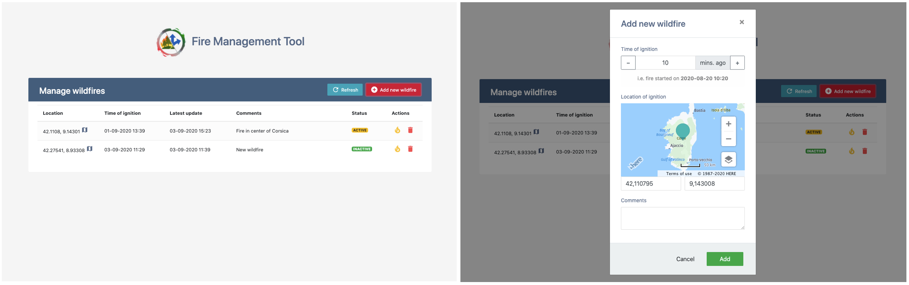
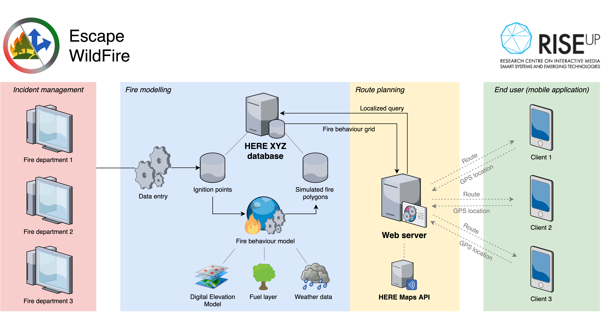

# EscapeWildFire

## About the *EscapeWildFire* framework

Wildfires have a great impact on a considerable number of countries around the world, costing thousands of lives yearly and inflicting large societal and economical problems in the affected region. Being able to escape wildfires is often difficult and dangerous without prior knowledge of the fire propagation and the possible escape routes. The availability of modern technologies, such as smartphones, could significantly improve the provision of real-time information to ordinary citizens in order to help them to evacuate as soon as possible. The goal of *Escape Wildfires* is therefore to provide a framework for fire departments and governing bodies where they can enter information about wildfire observations, model the future spread of the fires and communicate escape routes to the public. The framework aims to provide this information with high precision and efficiency, based on the predicted spread of the wildfire and the real-time location of the end user.

The framework consists of three main components:
1.  The **fire management application** (web application) where wildfires can be reported, (de)activated or deleted. This application runs on a Flask server, written in Python.
2.  The **system core** which (upon activation by the fire management tool) initiates a fire simulation, periodically updates the simulator and uploads the polygons to the HERE XYZ service.
3.  The **mobile application** which retrieves the active wildfire polygons from the HERE XYZ service and computes an escape route based on the user's location.

For a detailed explanation of the individual components and their interaction, please read the [documentation](Documentation.pdf) or watch the [presentation video](Presentation.mp4).

## Screenshots
### Mobile application


### Fire management tool


## How to run EscapeWildFire?
#### Before starting
1.  The fire simulation engine is a crucial component of the EscapeWildFire platform. At this point, the software makes use of the [FireCaster API](https://firecaster.universita.corsica/) developed by the Università di Corsica Pasquale Paoli. However, the limitation is that currently only areas of France can be used to simulate fires. As a consequence, EscapeWildFire is currently limited to this area. It is expected that more areas are added in the near future. For this, the authors of the FireCaster API can be contacted. Alternatively, it is possible to integrate another simulation engine (either internally or externally) to solve this issue.
2. Get authorization keys from [Windy API](https://api.windy.com/) and [HERE XYZ](https://www.here.xyz/).
3.  Paste keys into the *simulateWildfire.py* files (inside the /WebApplication folder).
4.  Also paste the HERE XYZ API key in the *authToken* variable within the *ApiHandler.kt* file (inside the AndroidApp/app/src/main/java/com/ewf/escapewildfire folder).

#### Running the fire management tool
1.  Install the Python dependencies *SQLite3* and *Flask*.
2.  Go into the *WebApplication* directory.
3.  Execute the *python3 webApplication.py* command to run the main program.
4.  Open *localhost:5000* in the browser.
5.  Start managing wildfires in the browser and observe the mobile application.

#### Running the mobile application
1.  To run the app, first either clone or download the project to your pc. Once you have the project folder somewhere on your pc, use android studio to browse to the folder. This folder should contain a folder named AndroidApp which android studio should recognize as an android studio project. Once you have opened the project, and android studio is done generating the necessary files, make sure you have an emulator (preferably android 8 or higher). If android studio is done generating the files and you have an emulator ready, you should be able to press the green play button in the top right corner of android studio to launch the app on the emulator. However, before it will work properly the application needs to be updated with the correct credentials. These are discussed below. To be able to run the application, at least the HERE Maps credentials in the manifest and the bearer token for HERE XYZ need to be updated.
2.  To adapt the application for your own purpose there are a couple of things that can be changed and some that need to be changed. If android studio's project view is set to android you should be able to find a folder called raw in the res (resources) folder. This folder contains two csv files, ccen.csv should not need to be edited. This one contains the mapping between a country code and the emergency numbers for that country. The second csv file, shelers.csv, is used to place shelters on the map. What does need to be changed is the credentials for the HERE MAP services, these are located in the android manifest. You will also need to acquire a set of credentials by registering your application on http://developer.here.com. Each application requires a unique set of credentials. When you register your app, the registered bundle identifier must match the applicationId in your project's build.gradle. You can add credentials to your app by opening the app/src/main/AndroidManifest.xml file and modifying the following `<meta-data>` tags:

```
<meta-data android:name="com.here.android.maps.appid" android:value="{YOUR_APP_ID}"/>
<meta-data android:name="com.here.android.maps.apptoken" android:value="{YOUR_APP_CODE}"/>
<meta-data android:name="com.here.android.maps.license.key" android:value="{YOUR_LICENSE_KEY}"/>"/>
```

For more information check the HERE SDK documentation (https://developer.here.com/documentation/android-premium/3.16/dev_guide/topics/overview.html)

The same goes for the authToken that can be found in the ApiHandler class, however this token needs to be retrieved from the HERE XYZ service.
Instructions for this can be found here: https://www.here.xyz/api/quickstart/acquiringcredentials/

3.  For instructions on how to publish an app to the google play store please check the following link:
https://support.google.com/googleplay/android-developer/answer/113469?hl=en

## Overview of framework


## Contact
In case of any questions or requests, an e-mail can be sent to:
| Name | Affiliation | Email |
| ------ | ------ | ------ |
| Andreas Kamilaris | RISE CoE | [a.kamilaris@rise.org.cy](mailto:a.kamilaris@rise.org.cy) |
| Jesper Provoost | University of Twente | [j.c.provoost@utwente.nl](mailto:j.c.provoost@utwente.nl) |
| Wouter Couwenbergh | University of Twente | [w.couwenbergh@utwente.nl](mailto:w.couwenbergh@utwente.nl) |
