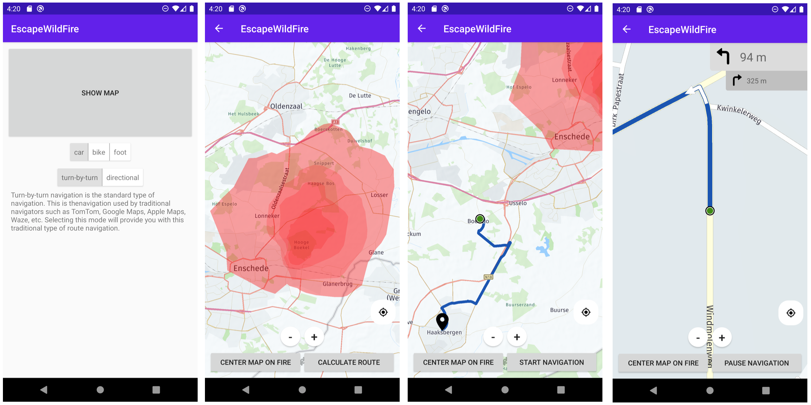

# EscapeWildFire

## About the *EscapeWildFire* framework

Wildfires have a great impact on a considerable number of countries around the world, costing thousands of lives yearly and inflicting large societal and economical problems in the affected region. Being able to escape wildfires is often difficult and dangerous without prior knowledge of the fire propagation and the possible escape routes. The availability of modern technologies, such as smartphones, could significantly improve the provision of real-time information to ordinary citizens in order to help them to evacuate as soon as possible. The goal of *Escape Wildfires* is therefore to provide a framework for fire departments and governing bodies where they can enter information about wildfire observations, model the future spread of the fires and communicate escape routes to the public. The framework aims to provide this information with high precision and efficiency, based on the predicted spread of the wildfire and the real-time location of the end user.

The framework consists of three main components:
1.  The **fire management application** (web application) where wildfires can be reported, (de)activated or deleted. This application runs on a Flask server, written in Python.
2.  The **system core** which (upon activation by the fire management tool) initiates a fire simulation, periodically updates the simulator and uploads the polygons to the HERE XYZ service.
3.  The **mobile application** which retrieves the active wildfire polygons from the HERE XYZ service and computes an escape route based on the user's location.

For a detailed explanation of the individual components and their interaction, please read the [documentation](Documentation.pdf) or watch the [presentation video](Presentation.mp4).

## Screenshots
### Mobile application

### Fire management tool

## How to run EscapeWildFire?
#### Before starting
1.  The fire simulation engine is a crucial component of the EscapeWildFire platform. At this point, the software makes use of the [FireCaster API](https://firecaster.universita.corsica/) developed by the Università di Corsica Pasquale Paoli. However, the limitation is that currently only areas of France can be used to simulate fires. As a consequence, EscapeWildFire is currently limited to this area. It is expected that more areas are added in the near future. For this, the authors of the FireCaster API can be contacted. Alternatively, it is possible to integrate another simulation engine (either internally or externally) to solve this issue.
2. Get authorization keys from [Windy API](https://api.windy.com/) and [HERE XYZ](https://www.here.xyz/).
3.  Paste keys into the *simulateWildfire.py* files (inside the /WebApplication folder).
4.  Also paste the HERE XYZ API key in the *authToken* variable within the *ApiHandler.kt* file (inside the AndroidApp/app/src/main/java/com/ewf/escapewildfire folder).

#### Running the fire management tool
1.  Install the Python dependencies *SQLite3* and *Flask*.
2.  Go into the *WebApplication* directory.
3.  Execute the *python3 webApplication.py* command to run the main program.
4.  Open *localhost:5000* in the browser.
5.  Start managing wildfires in the browser and observe the mobile application.

#### Running the mobile application
To be continued.

## Overview of framework

## Contact
In case of any questions or requests, an e-mail can be sent to:
| Name | Affiliation | Email |
| ------ | ------ | ------ |
| Andreas Kamilaris | RISE CoE | [a.kamilaris@rise.org.cy](mailto:a.kamilaris@rise.org.cy) |
| Jesper Provoost | University of Twente | [j.c.provoost@utwente.nl](mailto:j.c.provoost@utwente.nl) |
| Wouter Couwenbergh | University of Twente | [w.couwenbergh@utwente.nl](mailto:w.couwenbergh@utwente.nl) |
